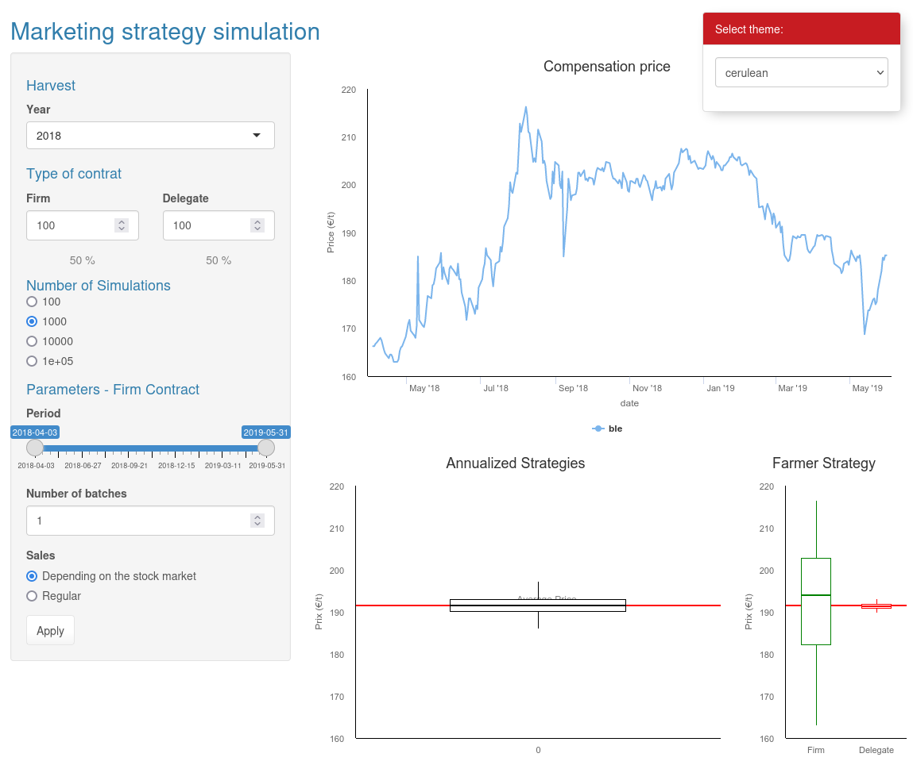

```{r setup, include=FALSE}
knitr::opts_chunk$set(echo = FALSE)

# Learn more about creating websites with Distill at:
# https://rstudio.github.io/distill/website.html

# Learn more about publishing to GitHub Pages at:
# https://rstudio.github.io/distill/publish_website.html#github-pages

# site: distill::distill_website
# output: distill::distill_article

# output: bookdown::gitbook
# site: bookdown::bookdown_site

```

* Notebooks:
  - [Dataiku Interview](docs/analysis_jjoumaa.html): Test job interview for <a href="https://www.dataiku.com/" style="color: black; text-decoration: underline;">Dataiku</a>
  - [Sægus Interview](docs/presentation_jjoumaa.html): Test job interview for <a href="https://saegus.com/" style="color: black; text-decoration: underline;">Sægus</a> 
* Webapps:
  - [Dash (Python)](https://agile-wildwood-23168.herokuapp.com/): webapp used as a proof of concept for risk assessment in wheat trading
  {width=50%}
  - [Shiny (R)](https://joffreyjoumaa.shinyapps.io/shiny_risk/): same application but using R and Shiny (it was one of the first version before switching to Python and Dash)
  {width=50%}
* Package:
  - [weanlingNES](https://jjoumaa.ddns.net/weanlingNES/): R package developed as part of my current position. Its goal is to provide in the same place analyses and functions developed within the framework of my postdoc on the ontogeny of diving behavior in northern elephant seals (*Mirounga angustirostris*)
* Publications
  - **Jouma'a, Joffrey** Phd Thesis - 2016: Resource Acquisition Strategies and Cost of Transport in Southern Elephant Seal (<a href="http://www.theses.fr/2016LAROS014" style="color: black; text-decoration: underline;">http://www.theses.fr/2016LAROS014</a>)
  - **Jouma’a, Joffrey**, Yves, Le Bras, Picard, Baptiste & Guinet, Christophe. (2017) Three-dimensional assessment of hunting strategies in a deep diving predator. Marine Ecology Progress Series (<a href="https://www.int-res.com/abstracts/meps/v573/p255-268/" style="color: black; text-decoration: underline;">10.3354/meps12191</a>)
  - **Jouma’a, Joffrey**, Yves, Le Bras, Richard, Gaëtan, Vacquié-Garcia, Jade, El Ksabi, Nory, Picard, Baptiste & Guinet Christophe. (2016) Adjustment of diving behaviour with prey encounters and body condition in a deep diving predator: the Southern Elephant Seal. Functional Ecology, 30, (4), 636-648 (<a href="https://besjournals.onlinelibrary.wiley.com/doi/full/10.1111/1365-2435.12514" style="color: black; text-decoration: underline;">10.1111/1365-2435.12514</a>)
  - Cazau, Dorian, Bonnel, Julien, **Joffrey, Jouma’a**, Yves, Le Bras & Guinet Christophe. (2017) Measuring the marine soundscape of the Indian Ocean with Southern Elephant Seals used as acoustic gliders of opportunity. Journal of Atmospheric and Oceanic Technology (<a href="https://journals.ametsoc.org/view/journals/atot/34/1/jtech-d-16-0124.1.xml" style="color: black; text-decoration: underline;">10.1175/JTECH-D-16-0124.1</a>)
  - Day, Louise, **Jouma’a, Joffrey**, Bonnel, Julien & Guinet Christophe. (2017) Acoustic measurements of post-dive cardiac responses in southern elephant seals (*Mirounga leonina*) during surfacing at sea. Journal of Experimental Biology (<a href="https://journals.biologists.com/jeb/article/220/9/1626/19618/Acoustic-measurements-of-post-dive-cardiac" style="color: black; text-decoration: underline;">10.1242/jeb.146928
</a>)
  - Yves, Le Bras, **Jouma’a, Joffrey**, Picard, Baptiste & Guinet Christophe. (2016) How elephant seals (*Mirounga leonina*) adjust their fine scale horizontal movement and diving behaviour in relation to local prey encounter rate. PLoS One (<a href="https://journals.plos.org/plosone/article?id=10.1371/journal.pone.0167226" style="color: black; text-decoration: underline;">10.1371/journal.pone.0167226</a>)
  - Génin, Alexandre, Richard, Gaëtan, **Jouma’a, Joffrey**, Picard, Baptiste, El Ksabi, Nory, Vacquié-Garcia, Jade & Guinet Christophe. (2015) Characterization of postdive recovery using sound recordings and its relationship to dive duration, exertion and foraging effort of southern elephant seals (*Mirounga leonina*). Marine Mammal Science, 1748-7692 (<a href="https://onlinelibrary.wiley.com/doi/10.1111/mms.12235" style="color: black; text-decoration: underline;">10.1111/mms.12235</a>)
  - Richard, Gaëtan, Vacquié-Garcia, Jade, **Jouma’a, Joffrey**, Picard, Baptiste, Génin, Alexandre, Arnould, John, Bailleul, Frédéric & Guinet, Christophe, (2014) Variation in body condition during the post-moult foraging trip of southern elephant seals and its consequences on diving behaviour. Journal of Experimental Biology, 217, 2609-2619 (<a href="https://journals.biologists.com/jeb/article/217/14/2609/12154/Variation-in-body-condition-during-the-post-moult/" style="color: black; text-decoration: underline;">10.1242/jeb.088542</a>)

